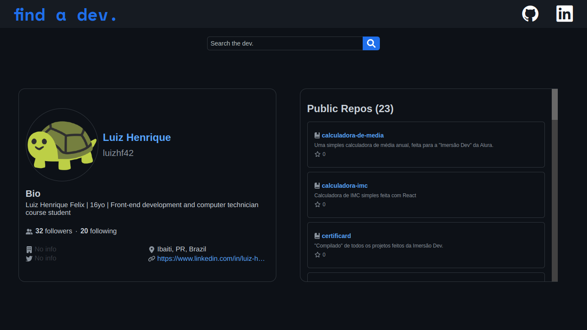

# find-a-dev 

A remaster of my "GitHub User Search" project, made with Vue.js

## Table of contents

- [Overview](#overview)
  - [The project](#the-project)
  - [Screenshot](#screenshot)
  - [Links](#links)
- [Process](#process)
  - [Built with](#built-with)
- [Credits](#credits)
- [Author](#author)

## Overview

### The project

A remaster of the "GitHub User Search" project, made in December. Users can search for others in GitHub by their username, and then get information (from the GitHub API) like name, bio, followers and following, repos, etc.

### Screenshot

### Links

- [Live Site URL](https://find-a-dev.vercel.app/)

## Process

### Built with

- HTML5
- SCSS
- TypeScript
- Axios
- Vue.js

## Credits

- <a href="https://docs.github.com/pt/rest">GitHub API</a>

## Author

- [Luiz Henrique Felix. 🐢](https://www.linkedin.com/in/luiz-henrique-felix)

